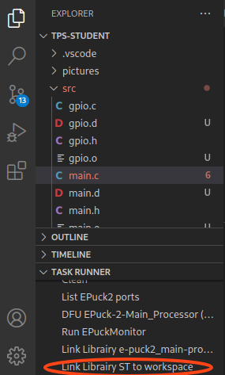
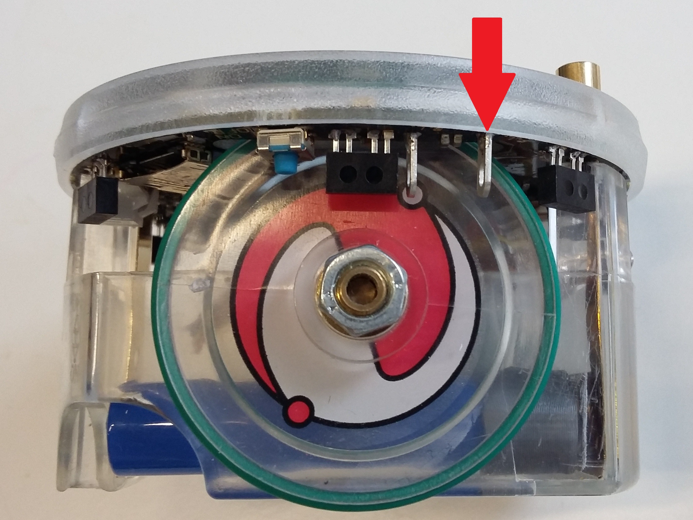
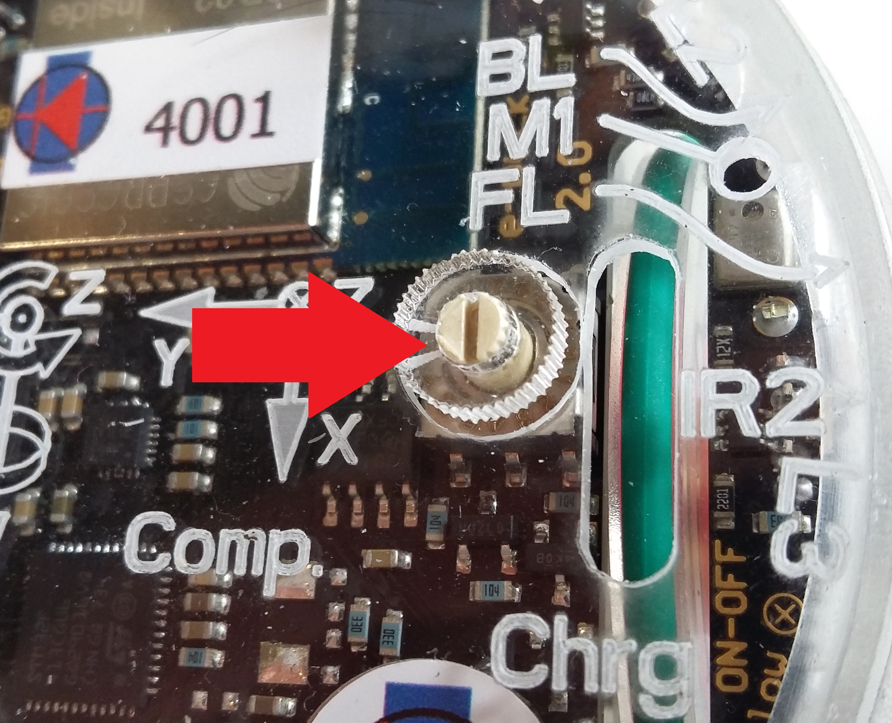

# Introduction
- Welcome in lab 1 of MICRO-315
- Please make sure you're confortable with all the tools covered in the introduction lab : `VSCode IDE`, `pyenv` and `git`
- `⏱ Duration`: 4 hours

## Goals
- This practical work shows all the necessary steps to program the e-puck2 miniature mobile robot in C, using the standard library provided by ST.
- The main goal is to gain knowledge of the STM32F4 microcontroller and refresh some concepts about peripherals such as GPIOs and TIMERs.

## Methodology
To achieve the main goal, we will go through the following steps:
  - Writing a first LED blinking program, first with *NOP* loops, then using timers
  - Change the LED's blinking sequence using the selector

## ⚠ TODO before starting the Lab
- execute the command `git checkout reference/TP1_Exercise`
  - all the files related to this lab should now be downloaded in your Workplace folder
- Create a symbolic link to the ST library (won't compile otherwise) by running the `Link Library ST to workspace` task
    

        
    

# Part 1 - STM32F4 Microcontroller and GPIO configuration
First read up to the end of those 2 documentation pages that will greatly help you for the rest of the lab
  - 👉 [Presenting the STM32](https://github.com/EPFL-MICRO-315/TPs-Wiki/wiki/STM32-Presenting-the-STM32)
  - 👉 [STM32 GPIO](https://github.com/EPFL-MICRO-315/TPs-Wiki/wiki/STM32-GPIO)

For the rest of the lab, you will need the documentation from STM (user guide and data sheet) as well as from the epuck (electronic diagram, etc.). Make sure you fetch those from their respective wiki pages before starting: 
- 👉 [Presenting the STM32](https://github.com/EPFL-MICRO-315/TPs-Wiki/wiki/STM32-Presenting-the-STM32): STM documentation
- 👉 [Presenting the EPuck2](https://github.com/EPFL-MICRO-315/TPs-Wiki/wiki/EPuck2-Presenting-the-EPuck2): EPuck2 documentation

## 6.1 Blink a LED automatically
> `Task 1`
>- Use a simple delay function to make **LED7** blink in a while loop at 1 Hz
>- Hints:
>   - Consult the electrical schema of the e-puck2 to find the **LED7** IO pin
>   - Use the functions declared in *gpio.c* to modify the state of the pin on which the LED is connected, and create a function that generate a time delay using assembly nop instructions
- 💡 keep in mind it is possible to watch the state of the register when the code is running in the EPuck2 !

## 6.2 Blink only the Front LED
> `Task 2`
>- Modify your code to blink only the 5mm red **FRONT_LED**
>- Hints:
>    - Consult the electrical schema of the e-puck2 to find the **FRONT_LED** IO pin
>    - If the LED doesn’t blink, compare the LED driving topology with the previous one and try to play with the **PUPDR** and **OTYPER** GPIO registers from the EmbSys Registers tabular
>    - Use the oscilloscope to measure the voltage level on the FRONT_LED test point, under the marked **FL** on the transparent cover (see below)
>    - 💡 **You can connect the GND to the screw that holds the cover**
>    - Describe the influence of both registers and try to explain the situation
>    - Adapt your code for this Output topology
>    - Take the opportunity to use the oscilloscope to measure the influence of 2 extreme values of **OSPEEDR** configuration for this GPIO and take a plot of both for rising and falling edges

  

- 💡 Don’t forget to pause the debugger to be able to change the register value from the EmbSys Registers

## 6.3 Blink only the 4 Body LEDs
> `Task 3`
>- Modify your code to blink only the 4 green **BODY_LEDs**
>- Hints:
>   - Consult the electrical schema of the e-puck2 to find the **BODY_LED** IO pin
>   - If the LEDs don’t blink, check in detail all characteristics of this GPIO (port, pins, topology)
>   - Can you explain why this output topology is used for **BODY_LED** and not the same than the **LED7** one for example?

## 6.4 Blink many LEDs automatically with a circular pattern
> `Task 4`
>- Blink the **LED1** → **LED3** → **LED5** → **LED7** with the following circular pattern sequence depending on the Selector state:
>    - ON1→ON3→ON5→ON7→OFF1→OFF3→OFF5→OFF7 or
>    - ON1→OFF1→ON3→OFF3→ON5→OFF5→ON7→OFF7
>- Hints:
>    - Consult the electrical schema of the e-puck2 to find the **LED1**, **LED3**, **LED5** and the **Selector** IO pins
>    - Create a function that returns the Selector states
>        - You must obviously configure the correct pins in the correct way to be able to read the Selector state
>        - You can then visualize the state of the Selector by looking at the IDR register of the related pins with the register tab when debugging
>    - Have a look on the comment close to the selector on the schema, can you explain it?
>    - Define different LED sequences depending on the Selector state
- 💡 The e-puck2 is equipped with a selector that you can use to configure different modes
  

    
  

# Part 7 - Timer Interrupt Tutorial
- In this section, you will use a timer to make the LED blink instead of using a while loop as you did in the previous exercise
- To do so, we ask you to configure the timer **TIM7** to periodically count up and, when it reaches the value set in the **ARR** register, to update the counter with a reload value and generate an interrupt
- It is then in the interrupt routine generated by the timer that you will have to change the state of the LED.
- First read through all this documentation page
  - click 👉 [here](https://github.com/EPFL-MICRO-315/TPs-Wiki/wiki/STM32-Timer)
- The configuration of the timer will be done in the file *timer.c*

## 7.1 Configure TIM7 to have interrupts at 1Hz
> `Task 5`
>- Look through the chapter 20 *Basic timers (TIM6 and TIM7)* in the Reference Manual to understand how to configure the **TIM7** timer
>- Configure **TIM7** for an interrupt frequency of 1Hz
>- Choose the correct timer prescaler **PSC** and reload value **ARR**
>- Hint:
>    - Find out the frequency of the bus on which the TIM7 is connected and deduce the frequency of the timer

## 7.2 Interrupt routine
- Now, when the timer update event triggers the interrupt, the execution of the main program is halted
- the processor's registers are saved on the stack and the processor's execution jumps to the corresponding address in the interrupt vector table
- When the ISR returns, the processor's registers are restored and the execution of the main program continues.
- In the timer interrupt you have to manually clear the update interrupt flag **UIF** in the timer status register **SR** (see *TIM6/TIM7* status register *(TIMx_SR)* Reference Manual page 708)

## 7.3 Toggle LED7 with TIM7 at 1Hz
> `Task 6`
>- Write a code that toggles the LED 7 of the e-puck2 robot using timer 7 implemented in the file *timer.c*
>- Hint:
>    - Include the *timer.h* header in the *main.c* file
