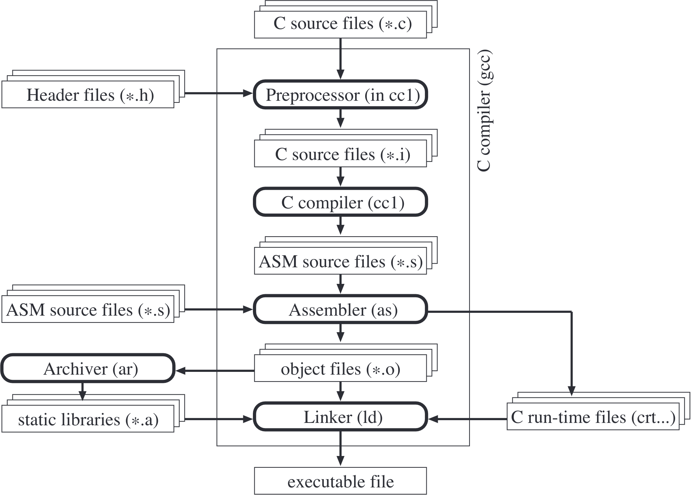

# Introduction
- Welcome in lab 1 of MICRO-315
- Please make sure you're confortable with all the tools covered in the introduction lab : `VSCode IDE`, `pyenv` and `git`
- `⏱ Duration`: 4 hours

## Goals
- You will see the compilation process in detail as you have learned during the lecture;
- Practical work will then show all the necessary steps to program the e-puck2 miniature mobile robot in C, using the standard library provided by ST;
- The main goal is to gain knowledge of the STM32F4 microcontroller and refresh some concepts about peripherals such as GPIOs and TIMERs.

## Methodology
To achieve the main goal, we will go through the following steps:
  - Understanding some basic features of the compiler;
  - Writing a first LED blinking program, first with *NOP* loops, then using timers;
  - Change the LED's blinking sequence using the selector.

## ⚠ TODO before starting the Lab
- Ensure your local repository is correctly set up as indicated in the [Setting up Git for TPs](https://github.com/EPFL-MICRO-315/TPs-PrivateWiki/wiki/Git-Setting-up-git-for-TPs) wiki page.
- Checkout to the branch of the lab:
```shell
git fetch reference # Update your local git index
git checkout reference/TP1_Exercise

```
This should create a local version of the remote TP1_Exercise branch and give you access to all the files related to this lab.

Alternatively, you can use the VSCode git plug-in or git graph extension to fetch the `reference` remote and checkout to the correct branch.
- Create a symbolic link to the ST library (won't compile otherwise) by running the `Link Library ST to workspace` task
    <p float="left">
        
    </p>

# Part 1 - C Compiler
To understand how the code is generated, it is important to understand how the compiler works. The main compilation steps are summarized in [figure 1](#figure-1). In this first exercise we will explore this architecture experimentally.
> ### Figure 1
> Compilation steps in GCC
> <p float="left">
>   
> </p>

## 1.1 Generated code
- Create a new folder src under Workplace/TPs and create in it a file named **test.c**
- copy the [following code](#code-block-1) in it:
    >### Code block 1
    >```c
    >int main()
    >{
    >    int i, j, out = 0;
    >    for(i=0; i < 10; i++)
    >        for(j = 0; j < 10; j++)
    >            out += i + j;
    >    return out;
    >}
    >```
- Now open a terminal using VSCode EPuck2: `Ctrl` + `Shift` + `P` and then type and execute `View: Toggle Terminal`
- in the terminal, **cd** in the folder **Workplace/TPs/src**
  - 💡 executing `ls` or `dir` will display the content of the current folder, verify that **test.c** is there
- During the first practical, your code was compiled using the GNU toolchain for ARM processor through the VSCode task `Make`
  - this task was executing a Makefile itself executing GNU toolchain for ARM processor executables
- We will now compile the code using only the command line, in order to see the compilation process in detail. This is the standard and basic way to compile a program
- The command to compile the C code and generate an object files and all the intermediate steps is :
  ```shell
  arm-none-eabi-gcc -save-temps=obj -mcpu=cortex-m4 -c test.c -o test.o
  
  ```
  - **arm-none-eabi-gcc** is the command to launch the compiler
  - **-save-temps=obj** is used to save the intermediate files of the compilation process
  - **-mcpu=cortex-m4** is called to specify the processor that will execute the code
  - **-c** specifies to not do the linking step
- Compile the test.c file using the explained command in the terminal
- When executing the command, the shell searchs for an executable named arm-none-eabi-gcc in the folder specified in the **PATH** variables
  - executing the command in the VSCode EPuck2 internal terminal should not run in errors
    - in fact, this terminal was configured to add the arm-none-eabi toolchain to the **PATH** variables
  - ⚠ however executing this command from any other terminal might lead to errors:

    ```shell
    arm-none-eabi-gcc -save-temps=obj -mcpu=cortex-m4 -c test.c -o test.o
    
    ```

    <div class="box">output console:<pre>
    'arm-none-eabi-gcc' is not recognized as an internal or external command, an executable program or a batch file.
    </pre></div>

    - This error occurs because the command line instance doesn't know yet what is this command
    - We have to add the path to the folder containing the executable files in the **PATH** environment variable
    - the **PATH** variable is used to store the location of all the known executables the command line can call
    - Type the following command (a bit different depending on the OS) to add the path of the ARM toolchain

      ### set PATH for Windows
      <div class="box"><pre>
      set PATH=C:\Users\username\AppData\Roaming\EPuck2_Utils\arm_gcc_toolchain\bin;%PATH%
      </pre></div>

      ### set PATH for MacOS and Linux
      <div class="box"><pre>
      export PATH=/Users/username/Applications/EPuck2_Utils/arm_gcc_toolchain/bin:$PATH
      </pre></div>
      
    - ⚠ the exact path to the gcc-arm-none-eabi toolchain might depend on your installation
    - ⚠ This procedure is temporary, it applies only to this current existing command line window
    - You will have to set again the **PATH** variable if you open a new command line window
    - 🚀 Now the compilation command should execute correctly


> `Task 1`
> - Look at the files generated by the compilation
> - Which files have been generated?
> - Which file is generated from which step of the compiler?

> `Task 2`
> - Look in detail at the assembler code generated by the compiler. Understand the assembly language instructions by using the [Cortex-M4 Generic User Guide](https://github.com/EPFL-MICRO-315/TPs-Wiki/wiki/datasheets/Cortex-M4-generic-user-guide.pdf)
> - Hints:
>    - Look in particular at the functionality of the instructions **push**, **pop**, **mov**, **add**, **str**, **ldr**, **cmp** and **ble**
>    - What is the purpose of **sub sp, sp, #20** instruction at the beginning of the main function?
>    - Try to initialize more variables in the main function and see how this instruction will change

> `Task 3`
> - Remember the role of the instruction **#define** in C
> - Which step of compilation takes in charge this instruction?
> - To look at this aspect in a real example, create a source C file **.c** with the [following code](#code-block-2) in it
> - Then look at the **.i** file generated by the compilation

>### Code block 2
>```c
>#define PI      3.14
>#define CIRC(R) (2 * PI * R)
>int main()
>{
>    int circonference, rayon = 2;
>    circonference = CIRC(rayon);
>    return circonference;
>}
>```

## 1.2 Compilation process
> `Task 4`
> - Use the option **-v** to observe the detailed compilation process
> - Check the several steps and understand the main mechanisms
> - Verify that you can directly assemble assembler code with the following command:
>   - ```arm-none-eabi-as test.s -o test.o```

## 1.3 Compilation options
> `Task 5`
> - Change the compiling command (cursor up to repeat the last commands) and the content of the program to check the influence of some compilation options.
> - Check the warning option described in table [table 1](#table-1) on the code [code block 3](#code-block-3)
> - Describe the impact of these options and their use with the questions askedd in the table

>### Code block 3
>```c
>int main()
>{
>    int i, j, out = 0, k;
>    for(i = 0; i < 10; i++)
>        for(j = 0; j < 10; j++)
>            out += i + j;
>}
>```

>### Table 1
>| Option | Influence on compilation process | When is this option useful ? |
>|---|---|---|
>| -Wreturn-type | type answer here | ... |
>| -Wunused-variable | ... | ... |
>| -Wall | ... | ... |

> `Task 6`
>- Understand the compiling options described in table [table 2](#table-2) on the following [code block](#code-block-4):
>- Describe the influence of these options and when they are useful
>   - What is the impact on code size, use of memory, and execution speed?
>   - Compare the number of instructions necessary to execute a code with the different levels of optimization:
>     - no optimization: **-O0**
>     - optimization level 1: **-O1**
>     - optimization level 2: **-O2**
>     - optimization level 3: **-O3**
>- When could this type of optimization (**-O3** or **-funroll-loops**) generate big problems (imagine an embedded system with sensors and actuators)?
>- How can we force a correct optimization in this case?
>
>Hint: **-funroll-loops** only works when an optimization level is set (**-O1**, **-O2**, **-O3**)

>### Code block 4
>```c
>int main()
>{
>    int i, j, out = 0, k;
>    for(i = 0 ; i < 10; i++)
>        for(j = 0; j < 10; j++)
>          out += i + j;
>    return out;
>}
>```

>### Table 2
>| Option | Influence on compilation process | When is this option useful ? |
>|---|---|---|
>| -O0 | type answer here | ... |
>| -O1 | ... | ... |
>| -O2 | ... | ... |
>| -O3 | ... | ... |
>| -funroll-loops | ... | ... |
>| -funroll-loops -O3 | ... | ... |


# Part 2 - STM32F4 Microcontroller and GPIO configuration
First read up to the end of those 2 documentation pages that will greatly help you for the rest of the lab
  - 👉 [Presenting the STM32](https://github.com/EPFL-MICRO-315/TPs-Wiki/wiki/STM32-Presenting-the-STM32)
  - 👉 [STM32 GPIO](https://github.com/EPFL-MICRO-315/TPs-Wiki/wiki/STM32-GPIO)

For the rest of the lab, you will need the documentation from STM (user guide and data sheet) as well as from the epuck (electronic diagram, etc.). Keep their respective wiki pages close: 
- 👉 [Presenting the STM32](https://github.com/EPFL-MICRO-315/TPs-Wiki/wiki/STM32-Presenting-the-STM32): STM documentation
- 👉 [Presenting the EPuck2](https://github.com/EPFL-MICRO-315/TPs-Wiki/wiki/EPuck2-Presenting-the-EPuck2): EPuck2 documentation

## 2.1 Blink a LED automatically
> `Task 1`
> - Use a simple delay function to make **LED7** blink in a while loop at 1 Hz
> - Hints:
>   - Consult the electrical schema of the e-puck2 to find the **LED7** IO pin
>   - Use the functions declared in *gpio.c* to modify the state of the pin on which the LED is connected, and create a function that generate a time delay using assembly nop instructions

💡 keep in mind it is possible to watch the state of the register when the code is running in the EPuck2 !

## 2.2 Blink only the Front LED
> `Task 2`
>- Modify your code to blink only the 5mm red **FRONT_LED**
>- Hints:
>    - Consult the electrical schema of the e-puck2 to find the **FRONT_LED** IO pin
>    - If the LED doesn’t blink, compare the LED driving topology with the previous one and try to play with the **PUPDR** and **OTYPER** GPIO registers from the EmbSys Registers tabular
>    - Use the oscilloscope to measure the voltage level on the FRONT_LED test point, under the marked **FL** on the transparent cover (see below)
>    - 💡 **You can connect the GND to the screw that holds the cover**
>    - Describe the influence of both registers and try to explain the situation
>    - Adapt your code for this Output topology
>    - Take the opportunity to use the oscilloscope to measure the influence of 2 extreme values of **OSPEEDR** configuration for this GPIO and take a plot of both for rising and falling edges
<p float="left">
  
</p>
- 💡 Don’t forget to pause the debugger to be able to change the register value from the EmbSys Registers

## 2.3 Blink only the 4 Body LEDs
> `Task 3`
>- Modify your code to blink only the 4 green **BODY_LEDs**
>- Hints:
>   - Consult the electrical schema of the e-puck2 to find the **BODY_LED** IO pin
>   - If the LEDs don’t blink, check in detail all characteristics of this GPIO (port, pins, topology)
>   - Can you explain why this output topology is used for **BODY_LED** and not the same than the **LED7** one for example?

## 2.4 Blink many LEDs automatically with a circular pattern
> `Task 4`
>- Blink the **LED1** → **LED3** → **LED5** → **LED7** with the following circular pattern sequence depending on the Selector state:
>    - ON1→ON3→ON5→ON7→OFF1→OFF3→OFF5→OFF7 or
>    - ON1→OFF1→ON3→OFF3→ON5→OFF5→ON7→OFF7
>- Hints:
>    - Consult the electrical schema of the e-puck2 to find the **LED1**, **LED3**, **LED5** and the **Selector** IO pins
>    - Create a function that returns the Selector states
>        - You must obviously configure the correct pins in the correct way to be able to read the Selector state
>        - You can then visualize the state of the Selector by looking at the IDR register of the related pins with the register tab when debugging
>    - Have a look on the comment close to the selector on the schema, can you explain it?
>    - Define different LED sequences depending on the Selector state
- 💡 The e-puck2 is equipped with a selector that you can use to configure different modes
  <p float="left">
    
  </p>

# Part 3 - Timer Interrupt Tutorial
- In this section, you will use a timer to make the LED blink instead of using a while loop as you did in the previous exercise
- To do so, we ask you to configure the timer **TIM7** to periodically count up and, when it reaches the value set in the **ARR** register, to update the counter with a reload value and generate an interrupt
- It is then in the interrupt routine generated by the timer that you will have to change the state of the LED.
- First read through the 👉 [STM32-Timer documentation page](https://github.com/EPFL-MICRO-315/TPs-Wiki/wiki/STM32-Timer)
- The configuration of the timer will be done in the file *timer.c*

## 3.1 Configure TIM7 to have interrupts at 1Hz
> `Task 5`
>- Look through the chapter 20 *Basic timers (TIM6 and TIM7)* in the Reference Manual to understand how to configure the **TIM7** timer
>- Configure **TIM7** for an interrupt frequency of 1Hz
>- Choose the correct timer prescaler **PSC** and reload value **ARR**
>- Hint:
>    - Find out the frequency of the bus on which the TIM7 is connected and deduce the frequency of the timer

## 3.2 Interrupt routine
- Now, when the timer update event triggers the interrupt, the execution of the main program is halted
- the processor's registers are saved on the stack and the processor's execution jumps to the corresponding address in the interrupt vector table
- When the ISR returns, the processor's registers are restored and the execution of the main program continues.
- In the timer interrupt you have to manually clear the update interrupt flag **UIF** in the timer status register **SR** (see *TIM6/TIM7* status register *(TIMx_SR)* Reference Manual page 708)

## 3.3 Toggle LED7 with TIM7 at 1Hz
> `Task 6`
>- Write a code that toggles the LED 7 of the e-puck2 robot using timer 7 implemented in the file *timer.c*
>- Hint:
>    - Include the *timer.h* header in the *main.c* file
