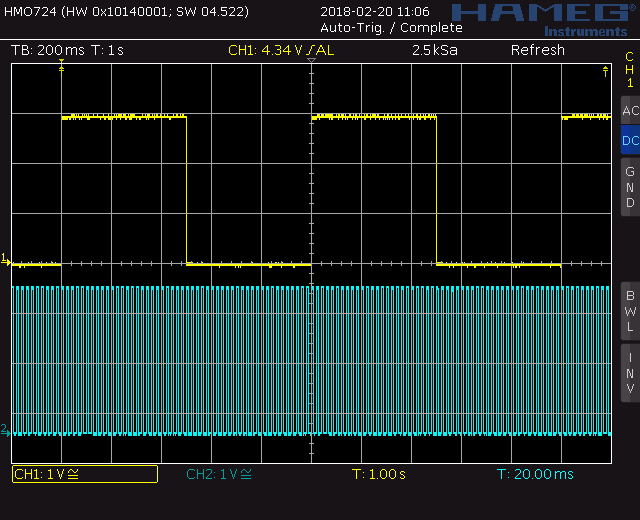
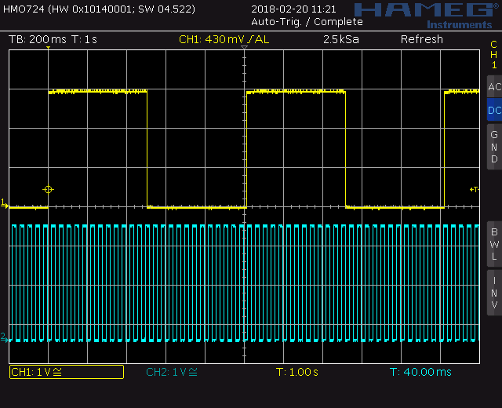
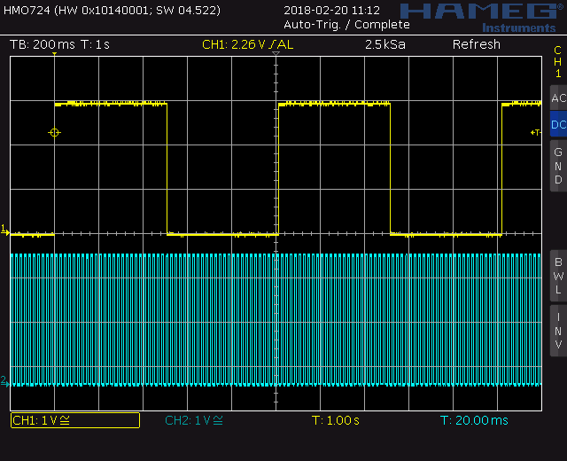
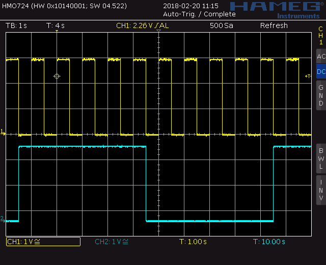
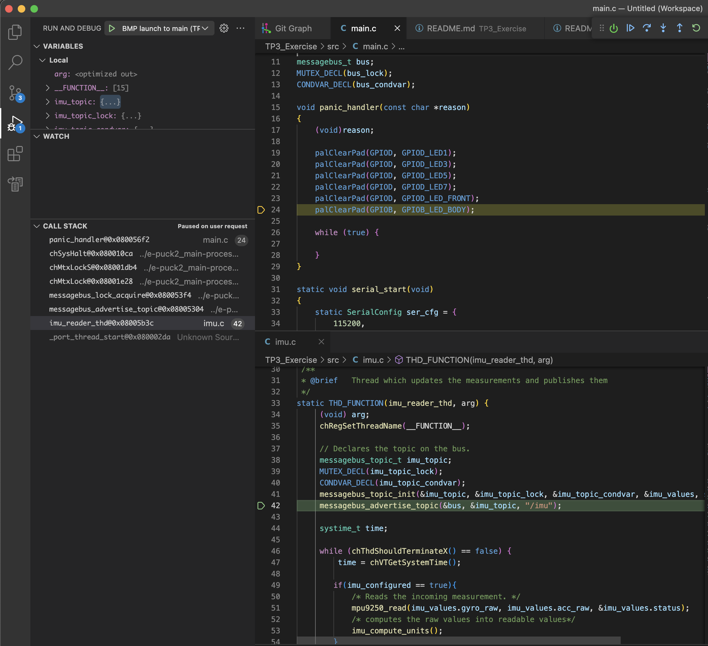

# Task 1: Thread sleep
- The best practice to use when working with threads is to specify moments when the threads can sleep. This means another thread can wake up if needed without the need to interrupt another thread or to switch regularly between threads. This frees the resources of the microcontroller and thus guarantees better timing for the threads
- **chThdSleepUntilWindowed()**: put the thread into sleep and tell ChibiOS ***to wake up the thread at the specified time***
- **chThdSleepMilliseconds()**: put the thread into sleep ***during a specified amount of time in ms from the call***
- The difference between **chThdSleepUntilWindowed()** and **chThdSleepMilliseconds()** is the way we choose the duration of the sleep:
    - Using **chThdSleepMilliseconds()** on a thread which takes 100ms to complete one loop iteration and sleeping it for 500ms, it means the thread will run every 600ms (100ms computational time + 500ms sleep).   
    But the computational time might not be stable, depending on executed code (conditional code, conditional waiting for example on sensors reading, ...) then the thread would not run at a stable period.
    - Doing the same with **chThdSleepUntilWindowed()**, it is then possible to specify exactly **when** the thread should wake up, without knowing the computational time of the thread.  
    The thing is to store the time at which the loop iteration begins as **reference time**, done by calling **chVTGetSystemTime()**, and use it in **chThdSleepUntilWindowed()** by speciying the reference time and until **when** (reference time + desired period time) the thread should sleep after this function call.
    - For example the [code block 1](#code-block-1), tells the system to wake up the thread every 10ms, no matter how long the thread lasts. Of course we need to be sure the computational time of the thread is smaller than the period we choose, otherwise it will not happen every 10ms.

>### Code block 1
```c
...
  systime_t time;

  while(1){
      time = chVTGetSystemTime();
      palTogglePad(GPIOD, GPIOD_LED_FRONT);
      chThdSleepUntilWindowed(time, time + MS2ST(10));
  }
...
```

- 💡 Note : **MS2ST()** macro converts milliseconds to system ticks, the unit used by the function **chThdSleepUntilWindowed()** for example

# Task 2: LEDs not blinking
- The two lines 155-156 used to create the threads are commented. Simply uncomment them
>### Code block 2
```c
...
    chThdCreateStatic(waThdFrontLed, sizeof(waThdFrontLed), NORMALPRIO, ThdFrontLed, NULL);
    chThdCreateStatic(waThdBodyLed, sizeof(waThdBodyLed), NORMALPRIO, ThdBodyLed, NULL);
...
```

# Task 3: Period of the threads using thread sleeps
- [Figure 1](#figure-1) shows that the periods of the LED's commutations is the same as expected in the code. It is normal as the threads use sleep mechanisms. For most usages, timings obtained with threads are precise enough. Otherwise real interrupts must be used.

>### Figure 1
>Oscilloscope view of **BODY_LED** (yellow) and **FRONT_LED** (blue) using thread sleeps
  <p float="left">
    
  </p>

# Task 4: Period of the threads using delays
- Here the difference is that the thread **ThdBodyLed** doesn't go to sleep, thus it uses nearly 100% of the computational time of the microcontroller
- But more important is that without going to sleep, the other threads need to preempt it to be able to run
- What is going on is that after the time configured in **chconf.h** on line 82 (see [code block 3](#code-block-3)), the thread **ThdBodyLed** is paused and the system switches the context in order to run the other threads, aka **ThdFrontLed**
- [Figure 2](#figure-2) shows that the period of **ThdFrontLed** is now 40ms instead of 20ms. This is because each thread has the guarantee to run at least 20ms (defined in **CH_CFG_TIME_QUANTUM**) before being paused by a thread of same priority if needed

>### Code block 3
```c
82  #define CH_CFG_TIME_QUANTUM                 20
```

>### Figure 2
>Oscilloscope view of **BODY_LED** (yellow) and **FRONT_LED** (blue) using delays
  <p float="left">
    
  </p>

# Task 5: Period of the threads with different priorities using delays
- To increase the priority of a thread, simply change the priority in the function used to create the thread, as explained in the theory
- For example set the priority one level higher by writing **NORMALPRIO+1**, as showed in the [code block 4](#code-block-4)
>### Code block 4
```c
...
chThdCreateStatic(waThdFrontLed, sizeof(waThdFrontLed), NORMALPRIO+1, ThdFrontLed, NULL);
chThdCreateStatic(waThdBodyLed, sizeof(waThdBodyLed), NORMALPRIO, ThdBodyLed, NULL);
...
```

- Now the result on the oscilloscope is back to the correct one ([figure 3](#figure-3))
- The period of **ThdFrontLed** is 20ms, which is correct
- This is because the priority of this thread has been raised
- Remember, the time quantum defined in **chconf.h** is used only for thread with same priorities in order to let them work alternately
- If a thread has a higher priority (here **ThdFrontLed**), then it can pause a lower priority thread whenever it needs

>### Figure 3
>Oscilloscope view of **BODY_LED** (yellow) and **FRONT_LED** (blue) using delays and different priorities
  <p float="left">
    
  </p>

# Task 6: Critical thread zones
- Here the system is locked during the whole computational time of the thread **ThdBodyLed**, thus the system cannot work properly because the lock lasts during a very long time
- Even the system tick cannot count properly with this system lock
- This is why there is a very bad blinking of the **FRONT_LED** in this case ([figure 4](#figure-4))
- **chSysLock()** should only be used during a little amount of time to not perturb the rest of the system, as said in the theory

>### Figure 4
>Oscilloscope view of **BODY_LED** (yellow) and **FRONT_LED** (blue) with system lock and delays
  <p float="left">
    
  </p>

# Task 7: Understanding of the code
There's a few concepts that should be taken away from analysing the IMU-related code and threads.
- The refresh rate of the main thread ```imu_reader_thd``` is set to 250Hz. When collecting data from sensors, a refresh rate is chosen and depends on various factors, such as the sensor's data acquisition rate (for instance, the camera needs some time (exposure time) to acquire a new single reading), the communication speed (in this case I2C 400kHz fast mode) and the other tasks that need to be completed by the microcontroller.
  - If you take a look at the sensor handling in the e-puck2_main-processor library (under src/sensors/*.c), you'll see that all sensors are designed with a fixed refresh rate;
  - ⚠ When building on top of sensor threads, you should not design code that fetches sensors values faster than they are refreshed ! By doing so, you would be fetching the same value several times, thus wasting resources of the MCU.
- The thread makes use of the messagebus to send over sensor values, and as a result, the messagebus needs to be initiateed somewhere. This happens in ```main.c``` with the function call ```messagebus_init(&bus, &bus_lock, &bus_condvar);```. Notice that this function is called before ```imu_start();``` which essentially starts the imu thread. Reversing this order could end up in errors as the thread would try to publish values on an undefined messagebus.
- In the ```mpu9250``` files, you can see that the microcontroller is communicating with the IMU sensor through I2C. Similarly, this I2C protocol needs be started (linked to I2C timers) and configured (speed, etc.) before it is used, and this is done through the ```i2c_start();``` function call in ```main.c``` before ```imu_start();```.


# Task 8: IMU_COMPUTE_OFFSET
- Here is an example ([code block 5](#code-block-5)) of **imu_compute_offset** implementation: It uses the same way to wait for new data as in the main function
- The types of variables to use are very important here. The goal is to select the ones that use the least space on the memory and that are enough to store the max possible value without an overflow. For example use of an **uint8_t** to store the number 300 will lead to a wrong result
- Here the argument **nb_samples** is an **uint16_t** (unsigned integer 16 bits), so at least an **uint16_t** must be used inside the function when counting to **nb_samples**
- For the temporary arrays declared on the beginning of the function, an **int32_t** must be used to sum a lot of measures which are signed.    
Simply because **nb_samples** (uint16_t) can go up to $2^{16}-1$ and the raw measurement (int16_t) can go from $-2^{16}/2$ to $2^{16}/2-1$.  
So making the calculation, the maximum value can reach $(2^{16}-1) * (2^{16}/2-1) < 2^{32}/2-1$ for the sum.    
Thus **int32_t** is enough
- The same method goes for the rest of the code.

>### Code block 5
```c
//imu.c
...
void imu_compute_offset(messagebus_topic_t * imu_topic, uint16_t nb_samples){

    //creates temporary array used to store the sum for the average
    int32_t temp_acc_offset[NB_AXIS] = {0};
    int32_t temp_gyro_offset[NB_AXIS] = {0};

    //sums nb_samples
    for(uint16_t i = 0 ; i < nb_samples ; i++){
        //waits for new measurements for IMU using MessageBus library
        messagebus_topic_wait(imu_topic, &imu_values, sizeof(imu_values));
        for(uint8_t j = 0 ; j < NB_AXIS ; j++){
            temp_acc_offset[j] += imu_values.acc_raw[j];
            temp_gyro_offset[j] += imu_values.gyro_raw[j];
        }
    }
    //finishes the average by dividing the sums by nb_samples
    //then stores the values to the good fields of imu_values to keep them
    for(uint8_t j = 0 ; j < NB_AXIS ; j++){
        temp_acc_offset[j]  /= nb_samples;
        temp_gyro_offset[j] /= nb_samples;

        imu_values.acc_offset[j] = temp_acc_offset[j];
        imu_values.gyro_offset[j] = temp_gyro_offset[j];
    }
    //specific case for the z axis because it should not be zero but -1g
    //deletes the standard gravity to have only the offset
    imu_values.acc_offset[Z_AXIS] += (MAX_INT16 / RES_2G); //16384 = 1g with a scale of 2G
}
...
```

# Task 9: IMU_COMPUTE_UNITS
- By looking at the implementation of the function **imu_start()** in the **imu.c** file, the range of the accelerometer is configured to 2G and the range of the Gyroscope to 250 DPS (Degrees Per Second)
- Also by looking at the points **4.6** and **4.7** of the mpu9250's datasheet, the ranges are signed 16bit values. So received datas will be int16_t representing -2g to 2g for the accelerometer and -250 DPS to 250 DPS for the gyroscope
- Thus by a simple rule of three, we can convert the raw values to $m/s^2$ for the accelerometer and to $rad/s$ for the gyroscope
- The function does nothing else than substracting the offset found previously, converting the raw measurements to the good units and storing them into the imu_values structure


>### Code block 6
```c
//imu.c
...

#define STANDARD_GRAVITY    9.80665f
#define DEG2RAD(deg)        (deg / 180 * M_PI)

#define RES_2G              2.0f
#define RES_250DPS          250.0f
#define MAX_INT16           32768.0f

#define ACC_RAW2G           (RES_2G / MAX_INT16) //2G scale for 32768 raw value
#define GYRO_RAW2DPS        (RES_250DPS / MAX_INT16) //250DPS (degrees per second) scale for 32768 raw value

...

 /**
 * @brief   Computes the measurements of the imu into readable measurements
 *      RAW accelerometer to m/s^2 acceleration
 *      RAW gyroscope to rad/s speed
 */
void imu_compute_units(void){
  for(uint8_t i = 0 ; i < NB_AXIS ; i++){
    imu_values.acceleration[i] = ( (imu_values.acc_raw[i] - imu_values.acc_offset[i]) 
                               * STANDARD_GRAVITY * ACC_RAW2G);
    imu_values.gyro_rate[i] = ( (imu_values.gyro_raw[i] - imu_values.gyro_offset[i]) 
                            * DEG2RAD(GYRO_RAW2DPS) );
  }
}

...
```

# Task 10: SHOW_GRAVITY
- Here two implementations are provided as examples:
    1) Using trigonometric functions ([code block 7](#code-block-7)) 
    2) A bit longer to write, using only conditions ([code block 8](#code-block-8))
- The two are doing the exact same thing, turning on the led to which the robot is leaning the most
- A simple threshold is used to not blink randomly the leds when the robot is perfectly horizontal because of the noise on the measurements
- If you look at the code, you can see that for the trigonometric example, the time measured with the timer measures only the duration of the **atan2()** function when for the second example, the time measured is for the whole set of conditions. The results are quite explicit, as the difference is huge. Thus a code well optimized can be really fast compared to another not optimized code
    - `Example 1 :` Time $[\mu s]$ for **atan2()** function : between **18 to 27 $\boldsymbol{\mu s}$** depending on the angle
    - `Example 2 :` Time $[\mu s]$ for the whole set of conditions : always **2 $\boldsymbol{\mu s}$**
- Note : Even if the `FPU` (Floating Point Unit) of the microcontroller is enabled in this code, the atan2() function doesn't use it. This is why is takes so much time to compute an arc tangent
- It is possible to use an optimized version of the atan() function written in assembler and using the FPU by including **fastmath.h** and calling specific functions but these functions also remove a lot of error verifications

>### Code block 7
```c
//main.c
...

void show_gravity(imu_msg_t *imu_values){

    //we create variables for the led in order to turn them off at each loop and to 
    //select which one to turn on
    uint8_t led1 = 0, led3 = 0, led5 = 0, led7 = 0;
    //threshold value to not use the leds when the robot is too horizontal
    float threshold = 0.2;
    //create a pointer to the array for shorter name
    float *accel = imu_values->acceleration;
    //variable to measure the time some functions take
    //volatile to not be optimized out by the compiler if not used
    volatile uint16_t time = 0;


    /*
    *   example 1 with trigonometry.
    */

    /*
    * Quadrant:
    *
    *       BACK
    *       ####
    *    #    0   #
    *  #            #
    * #-PI/2 TOP PI/2#
    * #      VIEW    #
    *  #            #
    *    # -PI|PI #
    *       ####
    *       FRONT
    */

    if(fabs(accel[X_AXIS]) > threshold || fabs(accel[Y_AXIS]) > threshold){

        chSysLock();
        //reset the timer counter
        GPTD11.tim->CNT = 0;
        //clock wise angle in rad with 0 being the back of the e-puck2 (Y axis of the IMU)
        float angle = atan2(accel[X_AXIS], accel[Y_AXIS]);
        //by reading time with the debugger, we can know the computational time of atan2 function
        time = GPTD11.tim->CNT;
        chSysUnlock();

        //rotates the angle by 45 degrees (simpler to compare with PI and PI/2 than with 5*PI/4)
        angle += M_PI/4;

        //if the angle is greater than PI, then it has shifted on the -PI side of the quadrant
        //so we correct it
        if(angle > M_PI){
            angle = -2 * M_PI + angle; 
        }

        if(angle >= 0 && angle < M_PI/2){
            led5 = 1;
        }else if(angle >= M_PI/2 && angle < M_PI){
            led7 = 1;
        }else if(angle >= -M_PI && angle < -M_PI/2){
            led1 = 1;
        }else if(angle >= -M_PI/2 && angle < 0){
            led3 = 1;
        }
    }

    //to see the duration on the console
    chprintf((BaseSequentialStream *)&SD3, "time = %dus\n",time);
    //we invert the values because a led is turned on if the signal is low
    palWritePad(GPIOD, GPIOD_LED1, led1 ? 0 : 1);
    palWritePad(GPIOD, GPIOD_LED3, led3 ? 0 : 1);
    palWritePad(GPIOD, GPIOD_LED5, led5 ? 0 : 1);
    palWritePad(GPIOD, GPIOD_LED7, led7 ? 0 : 1);

}

...
```
>### Code block 8
```c
//main.c
...

void show_gravity(imu_msg_t *imu_values){

    //we create variables for the led in order to turn them off at each loop and to 
    //select which one to turn on
    uint8_t led1 = 0, led3 = 0, led5 = 0, led7 = 0;
    //threshold value to not use the leds when the robot is too horizontal
    float threshold = 0.2;
    //create a pointer to the array for shorter name
    float *accel = imu_values->acceleration;
    //variable to measure the time some functions take
    //volatile to not be optimized out by the compiler if not used
    volatile uint16_t time = 0;

    /*
     *   example 2 with only conditions
     */

    chSysLock();
    GPTD11.tim->CNT = 0;

    //we find which led of each axis should be turned on
    if(accel[X_AXIS] > threshold)
        led7 = 1;
    else if(accel[X_AXIS] < -threshold)
        led3 = 1;

    if(accel[Y_AXIS] > threshold)
        led5 = 1;
    else if(accel[Y_AXIS] < -threshold)
        led1 = 1;

    //if two leds are turned on, turn off the one with the smaller
    //accelerometer value
    if(led1 && led3){
        if(accel[Y_AXIS] < accel[X_AXIS])
            led3 = 0;
        else
            led1 = 0;
    }else if(led3 && led5){
        if(accel[X_AXIS] < -accel[Y_AXIS])
            led5 = 0;
        else
            led3 = 0;
    }else if(led5 && led7){
        if(accel[Y_AXIS] > accel[X_AXIS])
            led7 = 0;
        else
            led5 = 0;
    }else if(led7 && led1){
        if(accel[X_AXIS] > -accel[Y_AXIS])
            led1 = 0;
        else
            led7 = 0;
    }
    time = GPTD11.tim->CNT;
    chSysUnlock();

    //to see the duration on the console
    chprintf((BaseSequentialStream *)&SD3, "time = %dus\n",time);
    //we invert the values because a led is turned on if the signal is low
    palWritePad(GPIOD, GPIOD_LED1, led1 ? 0 : 1);
    palWritePad(GPIOD, GPIOD_LED3, led3 ? 0 : 1);
    palWritePad(GPIOD, GPIOD_LED5, led5 ? 0 : 1);
    palWritePad(GPIOD, GPIOD_LED7, led7 ? 0 : 1);

}

...
```
# Task 11: Use library functions correctly
1) Initially the code provided for `main.c` called the following functions in this order:
   > ```c
   > //main.c
   > ...
   > int main(void)
   > {
   > ...
   >     i2c_start();
   >     imu_start();
   > 
   >     /** Inits the Inter Process Communication bus. */
   >     messagebus_init(&bus, &bus_lock, &bus_condvar);
   > ...
   > ```
    - this code worked, although there is a potential error that will be explained later.
2) Inverting functions calls
   > ```c
   > //main.c
   > ...
   > int main(void)
   > {
   > ...
   >     imu_start();
   >     i2c_start();
   > 
   >     /** Inits the Inter Process Communication bus. */
   >     messagebus_init(&bus, &bus_lock, &bus_condvar);
   > ...
   > ```
    - this code drives the microcontroller into the `panic_handler` routine, resulting in 4 red LEDs lit (as an error indicator) and the CPU locked in an infinite loop. This code prevents the system from going further in the cabbage and executing anything; that limits the problems;
    - as can be seen in [Figure 5](#figure-5), the system arrives in this code following the `messagebus_advertise_topic()` call in the `imu_reader` thread because the `bus` variable is not yet initialised. Indeed, the latter is initialised through the `messagebus_init()` function which is called after `imu_start()` in `main.c`.
    - adding a breakpoint in `messagebus_init()` and another one in `i2c_start()` enables to see that the program is able to reach the first function but not the second one. This means the panic handler, itself called in the `imu_reader` thread, is called at some point between the two functions.

    >### Figure 5
    >Cause of **panic_handler** call
        <p float="left">
        
        </p>
3) Why this problem did not occur with the code intially provided - Answer to the point 1:
    - The call of `messagebus_advertise_topic()` is made in the thread `imu_reader_thd`. This thread is set up by the function `imu_start()` but it is not necessarily started right after. However, depending on the code executed later (after `ìmu_start()`) this thread can be started:
    1) In case `messagebus_init()` is called immediately after, it seems sufficient that the `bus` variable is initialized just before the thread starts and needs it. This explains that this problem does not occur, but it is not guaranteed and not correct.
    2) In case `i2c_start()` is called between `imu_start()` and `messagebus_init()`, the `imu_reader_thd` thread is actually called before `messagebus_init()` has been able to initialize `bus` variable and this leads to access to an uninitiated structure, which is therefore forbidden.
    `panic_handler` is reserved by Chibios as a callback function, called when a system halting error arrises (cf. e-puck2_main-processor/src/chconf.h)
4) Summary
    - It is important to understand and correctly use the functions of a library and even more so with a multi-threaded system where the notion of poorly managed call order can lead to relatively complex problems to understand and correct.
    - The best is to take example of code of `e-puck2_main-processor/src/main.c` which is the demo code of the robot. This file is not used by your code but everything else is as a library.
    - So do not hesitate to look at the order of the function calls in this file and for information, the `bus` structure is also used for example for `proximity sensors`, but not only that...